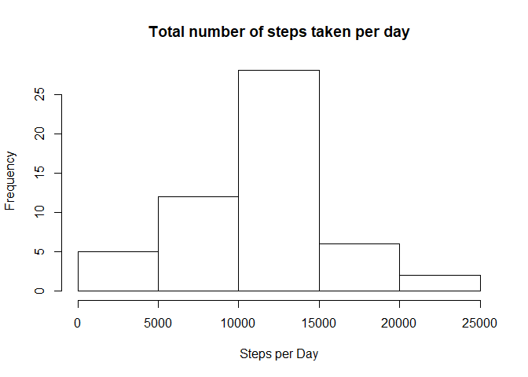
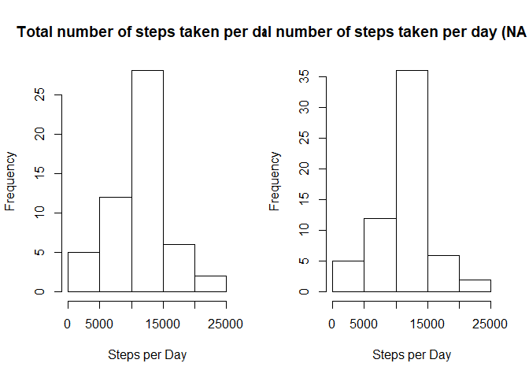
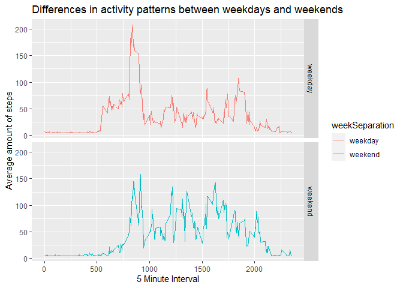

## Loading and preprocessing the data

Load dataset 'Activity' in appropriate dataframe


```r
activityMonitoring <- read.csv("activity.csv", header = TRUE, sep = ",", dec = ".")
head(activityMonitoring)
```

```
##   steps       date interval
## 1    NA 2012-10-01        0
## 2    NA 2012-10-01        5
## 3    NA 2012-10-01       10
## 4    NA 2012-10-01       15
## 5    NA 2012-10-01       20
## 6    NA 2012-10-01       25
```

```r
str(activityMonitoring)
```

```
## 'data.frame':	17568 obs. of  3 variables:
##  $ steps   : int  NA NA NA NA NA NA NA NA NA NA ...
##  $ date    : Factor w/ 61 levels "2012-10-01","2012-10-02",..: 1 1 1 1 1 1 1 1 1 1 ...
##  $ interval: int  0 5 10 15 20 25 30 35 40 45 ...
```

```r
names(activityMonitoring)
```

```
## [1] "steps"    "date"     "interval"
```

```r
summary(activityMonitoring)
```

```
##      steps                date          interval     
##  Min.   :  0.00   2012-10-01:  288   Min.   :   0.0  
##  1st Qu.:  0.00   2012-10-02:  288   1st Qu.: 588.8  
##  Median :  0.00   2012-10-03:  288   Median :1177.5  
##  Mean   : 37.38   2012-10-04:  288   Mean   :1177.5  
##  3rd Qu.: 12.00   2012-10-05:  288   3rd Qu.:1766.2  
##  Max.   :806.00   2012-10-06:  288   Max.   :2355.0  
##  NA's   :2304     (Other)   :15840
```

## What is mean total number of steps taken per day?

Assignment part 1: What is mean total number of steps taken per day?
Subset & calculate sum per day, put it in histogram

```r
daily_steps <- aggregate(steps ~ date, data = activityMonitoring, FUN = sum)
hist(daily_steps$steps, main = "Total number of steps taken per day", xlab = "Steps per Day")
```

<!-- -->

Calculate mean and median of steps per day

```r
meanSteps <- mean(daily_steps$steps)
mean(daily_steps$steps)
```

```
## [1] 10766.19
```

```r
medianSteps <- median(daily_steps$steps)
median(daily_steps$steps)
```

```
## [1] 10765
```

## What is the average daily activity pattern?

Assignment part 2: What is the average daily activity pattern?

```r
library(ggplot2)
stepsInterval <- aggregate(steps ~ interval, data = activityMonitoring, FUN = mean)
  g <- ggplot(stepsInterval, aes(interval, steps))
  g + geom_line()
```

<!-- -->

```r
    stepsInterval[which.max(stepsInterval$steps), ]
```

```
##     interval    steps
## 104      835 206.1698
```

## Imputing missing values

Assignment part 3: Imputing missing values
Calculate total number of missing rows
Create a new dataset that is equal to the original dataset but with the missing data filled in.

```r
sum(!complete.cases(activityMonitoring))
```

```
## [1] 2304
```

```r
activityMonitoring$steps[is.na(activityMonitoring$steps)] = mean(activityMonitoring$steps, na.rm=TRUE)
daily_steps2 <- aggregate(steps ~ date, data = activityMonitoring, FUN = sum)
par(mfrow = c(1,2))
hist(daily_steps$steps, main = "Total number of steps taken per day", xlab = "Steps per Day")
hist(daily_steps2$steps, main = "Total number of steps taken per day (NA = mean)", xlab = "Steps per Day")
```

<!-- -->

Calculate mean and median of steps per day

```r
meanSteps2 <- mean(daily_steps2$steps)
medianSteps2 <- median(daily_steps2$steps)
library(xtable)
result <- data.frame(c(meanSteps, medianSteps), c(meanSteps2, medianSteps2))
```
The replacement of missing values with the mean, doesn't have much effect on histogram, mean and median.

## Are there differences in activity patterns between weekdays and weekends?

Assignment part 4:
Plot 'Differences in activity patterns between weekdays and weekends'

```r
activityMonitoring$date <- as.Date(activityMonitoring$date, "%Y-%m-%d")
library(dplyr)
```

```
## 
## Attaching package: 'dplyr'
```

```
## The following objects are masked from 'package:stats':
## 
##     filter, lag
```

```
## The following objects are masked from 'package:base':
## 
##     intersect, setdiff, setequal, union
```

```r
activityMonitoring$day <- weekdays(activityMonitoring$date)
activityMonitoring <- mutate(activityMonitoring, weekSeparation = ifelse((day == "Sunday") | (day == "Saturday"), "weekend", "weekday"))
activityMonitoring$weekSeparation <- as.factor(activityMonitoring$weekSeparation)
stepsIntervalWeeksepation <- aggregate(steps ~ interval + weekSeparation, data = activityMonitoring, mean)
g <- ggplot(stepsIntervalWeeksepation, aes(interval, steps, color = weekSeparation))
g + geom_line() + facet_grid(weekSeparation~.) + ggtitle("Differences in activity patterns between weekdays and weekends") + xlab("5 Minute Interval") + ylab("Average amount of steps")
```

<!-- -->
